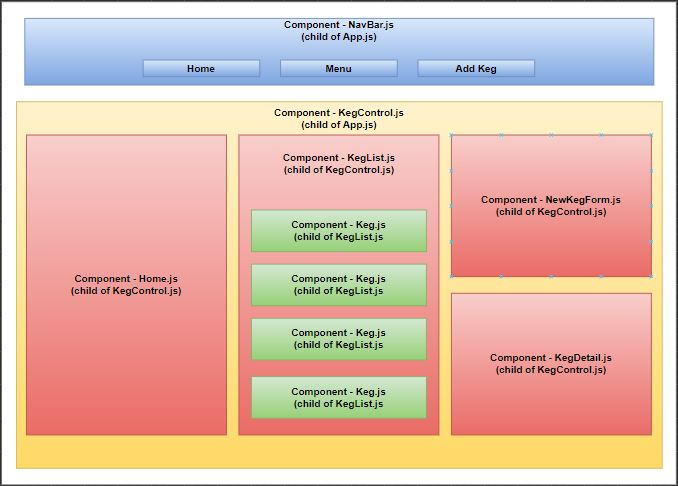

# Traditions Brew Tap House

#### By Jeff Terrell

#### A website for a tap house that manages kegs

## Technologies Used

* HTML
* CSS
* Bootstrap
* Javascript
* React
* NPM

## Description

This website uses React to create a single page application that displays types of kegs, their cost, and how many pints are left in them. Users are able to add new kegs, view them in a list, and subtract pints from a specific keg.

## Setup/Installation Requirements  

* Create and/or navigate to the directory you would like to contain this project on your computer.
* Type git clone https://github.com/JeffTerrell/Traditions-Brew-Tap-House to clone the repository to your local machine.
* Type npm install in the terminal to install all dependencies.  
* Type npm run start into the terminal to start a server displaying the webpage.

## Known Bugs

None at this time

## License

[MIT](https://opensource.org/licenses/MIT)

If you have any issues, questions, ideas or concerns, please reach out to me at my email and/or make a contribution to the code via GitHub.

Copyright (c) Jeff Terrell
